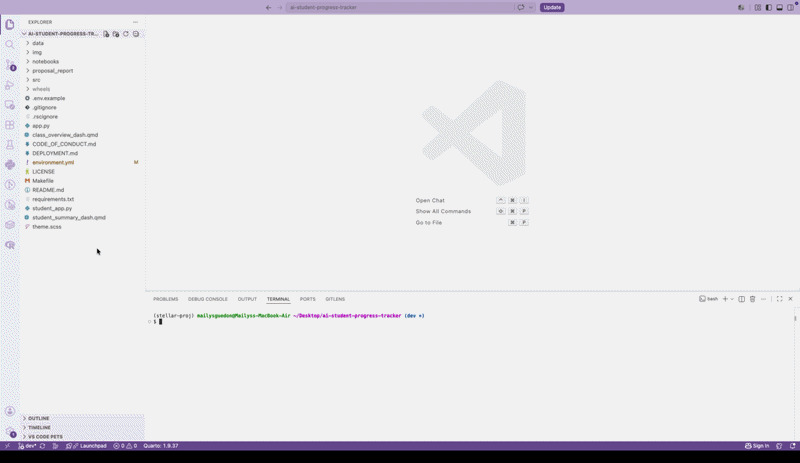

# Student Progress Tracker

## Overview

This Student Progress Tracker is a dashboard for visualising student performance. It provides insights into student's mastery over time for both teachers (Teacher View) and students (Student View).

## Instructions

You can run this app locally following the instructions below.

A video with a full run-through of the instructions can be found here : [Instruction Video](img/full_instructions.mp4)

### Setting up

To set up the workflow, follow the instructions below :
1. Clone this repository:

    ```bash
    git clone https://github.com/mailysg8/ai-student-progress-tracker.git
    ```

2. Navigate to the project directory locally:

    ```bash
    cd ai-student-progress-tracker
    ```

3. Install the required dependencies:

    ```bash
    conda env create -f environment.yml
    conda activate stellar-proj
    ```

> **Note on `pybkt` installation.** Because installing `pybkt` directly from PyPI causes issues on macOS, the repository bundles a custom wheel built for **macOS ARM** at `wheels/pybkt-1.4.1-cp311-cp311-macosx_11_0_arm64.whl`. The `environment.yml` installs this local wheel by default.
>
> **If you are not on macOS ARM** (e.g. Linux, Windows, or Intel Mac), open `environment.yml`, find the pip section, and replace:
>
> ```
>     - ./wheels/pybkt-1.4.1-cp311-cp311-macosx_11_0_arm64.whl
> ```
>
> with:
>
> ```
>     - pyBKT==1.4.1
> ```
>
> Then re-run `conda env create -f environment.yml` to install `pyBKT 1.4.1` directly from PyPI.

### Initial Data Setup

For the initial data setup, the following data files are required :

- Student Observations : File containing student attempts on questions as rows 
- Class Plan : File containing classes as rows
- MKC Weights : File containing rank and weight for each MKC
- KC_Map : File containing the mapping from KC to MKC as rows

They should be placed in the `data/raw` folder.

To create the dataframe, follow the instructions below :


1. Create a `.env` file in the project root (an example of what needs to be included can be found in the [.env.example](https://github.com/mailysg8/ai-student-progress-tracker/blob/f7bbe2cfd264b0eda53d64538efbede89e59a20a/.env.example) file)

3. Run the following commands in the terminal (make sure you are in the project root) to create the data frame needed for the dashboard :

    ```bash
    make all
    ```
There should now be a file called `final_student_kc_data.csv` in `data/processed` folder.

### Running the App

To run the app locally, follow the instructions below : 


1. Run the app in reload mode: 
    - Teacher View : 
    ```bash
    shiny run --reload app.py
    ```
    - Student View :
    ```bash
    shiny run --reload student_app.py
    ```


## Demo

The dashboard looks as follows :

### Teacher View


More information about the elements found in each the Class Overview Page can be found [here](https://github.com/mailysg8/ai-student-progress-tracker/issues/44).

### Student View


