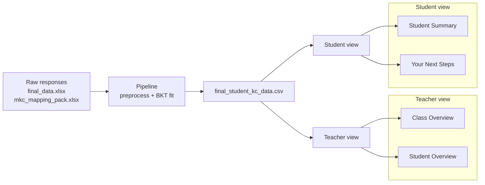

# Methodology

## Why Bayesian Knowledge Tracing

We began model selection with a simple question: what does Stellar Education actually need this system to do? The goal was not to grade a class that has already ended — it is to guide data collection for future cohorts, deciding which knowledge components to assess next and which students need more practice on which skills. That is a forward-looking problem, and it called for a method that revises its estimate of a student's mastery as new attempts arrive over the course of the term, so the recommendations always reflect where each student stands now.

BKT met that need, and we chose it over the alternatives for four reasons:

1. **It works on small cohorts.** Deep-learning approaches such as Deep Knowledge Tracing (DKT) typically need thousands of observations to train reliably and would overfit on our data. BKT estimates only four parameters per knowledge component, so it produces meaningful estimates from a class of 25 students across 47 KCs.
2. **It matches the structure of our data.** Student responses to questions, on a skill, recorded in the order they happened — this is precisely the sequential input BKT was designed to model.
3. **It updates without retraining.** Each new response refines a student's mastery estimate immediately, letting us track students continuously across the term and use the most recent estimate to decide what to assess next.
4. **Its output is interpretable.** Mastery is expressed as a single probability between 0 and 1, so Stellar Education can read it directly — *"this student has a 73 % chance of having mastered this skill"* — and act on it.

---

## How BKT works

BKT treats mastery as a hidden state that is updated after each new observation, using four interpretable parameters estimated separately for each knowledge component:

| Parameter | Meaning |
|---|---|
| **P(L₀)** — prior knowledge | Probability the student already possesses the skill before any practice |
| **P(T)** — learning rate | Probability that, following an attempt, the student transitions from *not knowing* to *knowing* the skill |
| **P(G)** — guess | Probability of answering correctly without having mastered the skill |
| **P(S)** — slip | Probability of answering incorrectly despite having mastered the skill |

BKT keeps a running score, **P(Known)** — the chance the student has learned the skill. It starts at the initial-knowledge value P(L₀) and updates after every question in two steps: first adjusting the score based on whether the response was correct (using P(G) and P(S)), then nudging it up to account for the chance the student just learned something from the attempt (P(T)). That running score is the mastery probability used throughout the dashboard.

Because BKT updates after every attempt, the dashboard uses **only the most recent estimate per student–KC pair** as the current mastery value.

---

## Implementation notes

We fit BKT using three independent implementations — **pyBKT** (Badrinath, Wang, and Pardos 2021) on Google Colab, a custom EM implementation, and the **LearnSphere** BKT pipeline — to verify that observed behaviour was a property of the data rather than a particular library. All three converged to comparable parameters and similar item-level performance, so we concluded that the constraints came from data sparsity rather than the model implementation.

### Data sparsity and KC aggregation

Many fine-grained KCs had only a handful of student interactions, violating two requirements for stable BKT estimation: sufficient *vertical sequence* (multiple attempts per student–KC pair) and *horizontal depth* (enough students per KC). To address this, we aggregated fine-grained KCs into broader **modeling KCs** using the partner-supplied curriculum map, increasing observations per KC while reducing the total number of modelled skills from over 250 to 47.

### Evaluation

We split students 70 / 30 for train and test — splitting by student rather than by attempt to reflect real deployment conditions and prevent data leakage — and report two complementary metrics:

- **RMSE** captures how well-calibrated the predicted probabilities are (lower is better).
- **AUC** captures whether the model correctly ranks struggling students below stronger ones (1.0 is perfect, 0.5 is chance).

A model can do well on one metric and poorly on the other, so reporting both gives a fuller picture of model quality.

---

## Data product architecture

The pipeline joins every observation with its modeling-KC mapping, unit, BKT prediction, and class date — producing a single dataframe the dashboards consume directly. This decoupling isolates the modelling work from the UI and makes a redeployment a one-file change.

---

## Limitations

- **Two-state mastery.** BKT models mastery as binary — either mastered or not. Real understanding falls somewhere in between, so partial knowledge is not represented.
- **No forgetting.** BKT treats mastery as permanent and does not model decay between sessions. Because these estimates affect which students a tutor focuses on, they should *support* the tutor's judgment rather than replace it — especially for students with few recorded attempts.
- **Sparse cohort.** Estimates are based on 25 students in a single course. They should not be applied to other subjects or cohorts without refitting.

---

## Recommendations for data collection

Modelling revealed that mastery estimates fluctuate sharply with only two or three attempts per skill but stabilise around **eight to fifteen attempts** in simulation. This finding became a concrete data-collection target for the partner:

1. **Aim for at least eight attempts per KC.** Estimates below this should be treated as provisional rather than as hard facts.
2. **Prioritise critical skills.** Use the existing tier and exam-weighting metadata so high-importance KCs hit the eight-attempt threshold first.
3. **Follow the prerequisite structure.** Collect data on foundational KCs first — they carry the most diagnostic value for downstream skills.
4. **Validate predictively.** Once richer data is available, test the mastery estimates against an independent metric (such as a final exam) to confirm they predict real performance.

The eight-to-fifteen-attempt rule was derived in simulation and needs to be confirmed once real high-volume cohort data is available.
