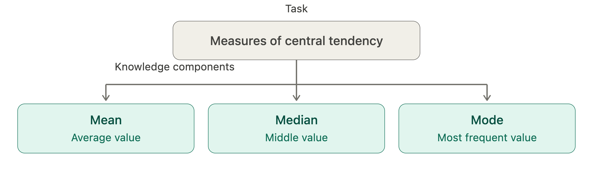
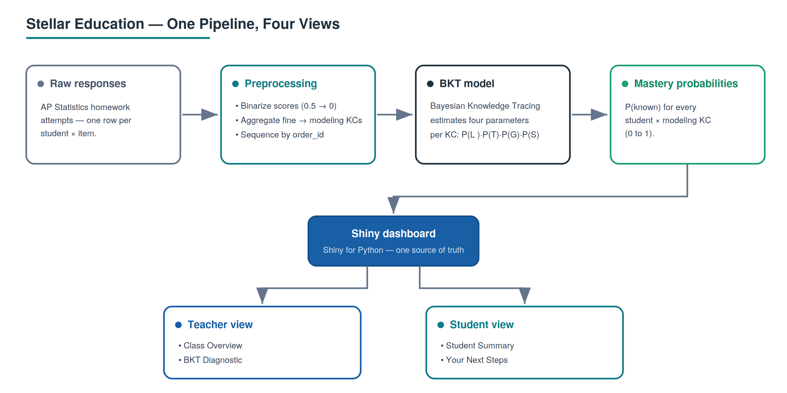
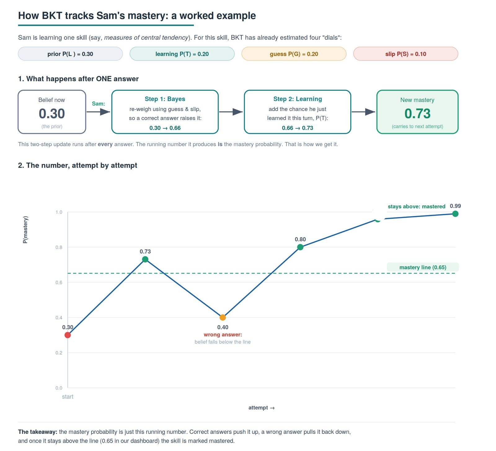
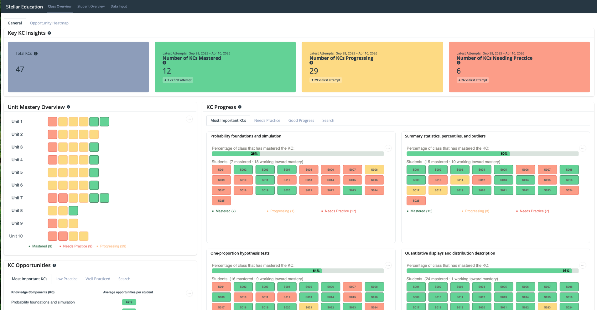
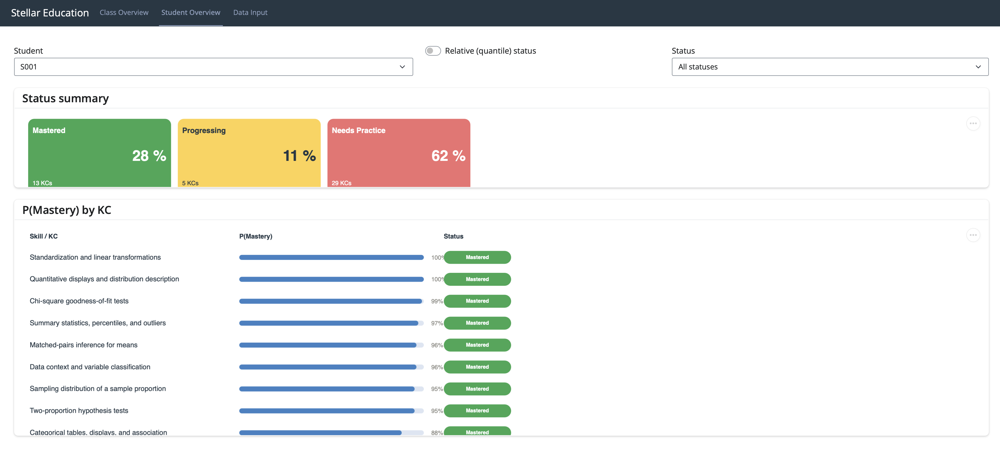
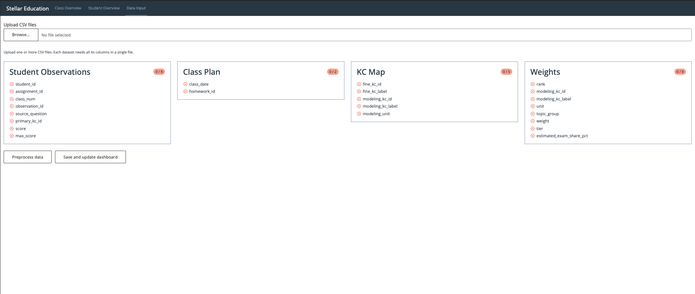
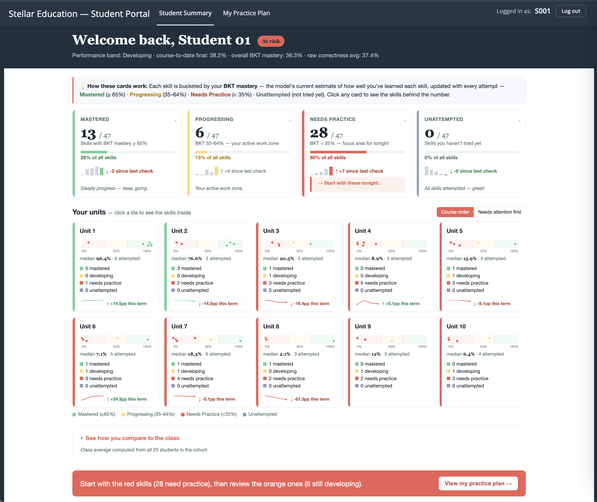
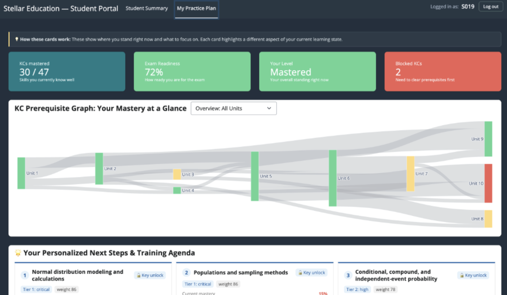

```{python}
import pandas as pd
from IPython.display import Markdown

summary_table = pd.read_csv('tables/summary_table.csv', index_col='observation')
practice_summary = pd.read_csv('tables/practice_summary.csv', index_col='Practice Level')
kc_agg_results = pd.read_csv('../../data/outputs/kc_agg_results.csv', index_col='approach')

nb_students = summary_table.loc['nb_students','value']
nb_units = summary_table.loc['nb_units','value']
nb_kc = summary_table.loc['nb_kc','value']
start_date = summary_table.loc['start_date','value']
end_date = summary_table.loc['end_date','value']
min_nb_attempts = summary_table.loc['min_nb_attempts','value']
max_nb_attempts = summary_table.loc['max_nb_attempts','value']

baseline = kc_agg_results.loc['Baseline','Number of groups']
reduction = round(((baseline - kc_agg_results['Number of groups'].nlargest(2).iloc[-1])/baseline)*100)
```

# Executive summary

**A homework score is a poor diagnostic tool**. In fact, report-card grades tell a parent or teacher *how much* a student got right but say nothing about *which* skills are behind. This discrepancy is what Stellar Education strives to remedy; to give teachers, students, and parents a clear, skill-by-skill view of where each student stands. 

We implemented this by first converting raw AP Statistics homework responses into mastery probabilities for each student, per-skill using **Bayesian Knowledge Tracing (BKT)**, an established method for inferring whether a learner has genuinely grasped a skill from the pattern of their responses over time [@corbett1995kt]. Then, we rendered those estimates through an interactive **Shiny** dashboard built around two audiences: a teacher view for catching at-risk students early, and a student view that turns the same numbers into a personalised plan, highlighting *what to work on next*. 


# Introduction

Stellar Education is a startup that runs small-group private tutoring for students and aims to replace generic instructions with something genuinely tailored to each learner. Achieving this requires knowing, with real precision, what a student does or does not understand. 


**A 70% quiz score only shows that three out of ten questions were missed, it doesn't reveal which skills were lacking, whether those skills are critical for future material, or how a tutor should adjust instruction.** Bridging the gap between a grade and actionable insight became the central goal of this project.

We designed the product around three objectives, informed by the needs of our partner:

1. **Reliable insight.** Estimate mastery for every student–skill pair using a probabilistic model that accounts for factors such as guessing and careless mistakes.
2. **Instant visibility.** Present mastery estimates through an interface that teachers can interpret at a glance, and giving students targeted guidance beyond simply reviewing material.
3. **Timely intervention.** Prioritize the skills most in need of attention so meaningful learning gaps can be addressed early.

To achieve this, we use the **Knowledge Component (KC) ** as our primary unit of analysis. **A KC is a specific skill** required to complete a task and is more granular than a topic and more precise than a subject, isolating exactly what a student must know.

For example, a question involving **measures of central tendency** may appear as a single task, but it depends on **three separate KCs: finding the mean, median, and mode. ** A student may master one of these skills while struggling with the others.
Analyzing performance at the KC level moves beyond a single aggregate score. Instead of reporting that a student earned 70%, the model can identify which skills have been mastered, which are developing, and which remain uncertain, providing the information needed to determine the most effective next step.

{#fig-kc-concept width="80%"}


# Data

Stellar Education provided homework response data from `{python} int(nb_students)` AP Statistics students across `{python} int(nb_units)` instructional units and `{python} int(nb_kc)` modeled knowledge components. Responses were recorded between `{python} str(start_date)` and `{python} str(end_date)`. They also supplied KC relationship data (KC Nodes and KC Edges) describing prerequisite, dependency, and supporting relationships between knowledge components.

Each row in the raw dataset represents a student's response to a single assessment item. Every item is mapped to the knowledge component (KC) it assesses, allowing performance to be analyzed at either the item, skill, or student level.

Because multiple items may assess the same KC, we grouped responses by student-KC pair for modeling. Using `order_id` to maintain the sequence of attempts, we created a time series of responses for each student on each KC. This ordered sequence is the input to the mastery model, which estimates the probability that a student has mastered a given KC over time.


## Fields used by the model and dashboard

The final dataset output from our pipeline, `final_student_kc_data.csv`, contains many variables, but only the following are used directly by the model and dashboard:

- `student_id`: Anonymized student identifier (S001–S025).
- `modeling_kc_id` / `modeling_kc_label`: The knowledge component being assessed and its human-readable label.
- `order_id` / `kc_attempt`: Sequence indicators that preserve the order of observations for each student-KC pair.
- `correct`: Binary outcome indicating whether the response was correct.
- `state_predictions`: The model's estimated mastery probability, which drives the dashboard's mastery indicators and progress visualizations.
- `unit`: Groups knowledge components into the ten AP Statistics units used in the Unit Mastery view.


## Knowledge Component Structure

The dataset represents knowledge at two levels of granularity. Each homework response is tagged with a **fine-grained KC (`fine_kc_id` / `fine_kc_label`)**, which captures the specific concept being tested, and a **modeling KC (`modeling_kc_id` / `modeling_kc_label`)**, which groups related concepts into a broader skill. We estimated our mastery probabilities at the modeling-KC level, allowing evidence from multiple related items to be combined and reducing sparsity in the data.

## Curriculum Metadata and Data Considerations

In addition to student responses, Stellar Education provided metadata describing the relative importance of each KC. Our team used this information to prioritize skills in the dashboard, ensuring that foundational concepts and exam-relevant topics receive greater attention than isolated or low-impact skills.

### Data Quality and Ethics

We included data considerations and feedback from our Capstone Partner into the design process. 

- **Sparse coverage.** We discovered that not every student attempted every KC (as can be seen in @tbl-practice_summary), so the student-by-KC matrix is incomplete. The dashboard treats absent attempts as "not started" rather than as failures.

```{python}
#| label: tbl-practice_summary
#| tbl-cap: "Students grouped by practice level: no attempts (0), low practice (1-9), some practice (10-25), and well practiced (25+)."
Markdown(practice_summary.to_markdown())
```

- **Privacy.** Students are identified only by anonymized codes (S001–S025); no personally identifying information is used or displayed.
- **Mixed-type columns.** A revision-note column (`2026_27_revision_note`) loaded with mixed types and was excluded from modeling; it carries no signal for mastery estimation.

# Data Science Methods

{#fig-pipeline width=95%}


## Why Bayesian Knowledge Tracing (BKT)?

We began our model selection with a simple question: **What does Stellar Education actually need this system to do?** 

The goal was not to grade a class that has already ended; it is to guide data collection for future cohorts, deciding which knowledge components to assess next and which students need more practice on which skills. This is a forward-looking problem, and it called for a method that revises its estimate of a student's mastery as new attempts to questions arrive over the course of the term, so that our recommendations always reflect where each student stands now.

**BKT emerged as the most promising candidate to address this need**. We selected it as our primary model for evaluation based on four key advantages:

1. **Theoretical suitability for smaller cohorts.** Deep-learning approaches to knowledge tracing, such as Deep Knowledge Tracing (DKT), typically require thousands of observations to train reliably and would easily overfit our data. Because BKT estimates only four parameters per KC, it is designed to produce meaningful estimates from smaller samples, such as a class of `{python} int(nb_students)` students across `{python} int(nb_kc)` KCs [@badrinath2021]. 
2.	**It matches the structure of our data.** We have student responses to questions, on a skill, recorded in the order it happened, this is precisely the sequential input BKT was designed to model.
3.	**It updates without retraining.** Each new response refines a student's mastery estimate immediately, which lets us track students continuously across the term and use the most recent estimate to decide what to assess next.
4.	**Its output is interpretable.** Mastery is expressed as a single probability between 0 and 1, so Stellar Education can read it directly; "this student has a 73% chance of having mastered this skill," and act on it.

::: {.callout-note title="Methodological Motivation"}
**Given this theoretical advantage, an integral part of our experimentation and analysis involved evaluating how well BKT works with our cohort size.**
:::

## BKT Methodology

The core modeling question is: *given everything a student has answered so far, what is the probability they have actually mastered this skill?* BKT answers this by treating mastery as a hidden state that is updated after each new observation. It continuously refines this belief using **four interpretable parameters**, estimated separately for each knowledge component (KC) [@corbett1995kt; @bulut2023]. 

1. **P(L0): Prior knowledge.** The probability a student already possessed the skill before any practice took place.
2. **P(T): Learning rate.** The probability that, following an attempt, a student transitions from *not knowing* the skill to *knowing* it.
3. **P(G): Guess.** The probability of answering correctly without having mastered the skill.
4. **P(S): Slip.** The probability of answering incorrectly despite having mastered the skill.

The four parameters describe the skill, not the student. To track a student, BKT keeps a running score called P(Known), the chance the student has learned the skill. It starts at the initial-knowledge value [P(L)] and updates after every question in two steps. 

First, it adjusts the score based on whether the student got the question right or wrong, using the chance of a lucky guess [P(G)] and the chance of a careless slip [P(S)]. Then it nudges the score up a little to account for the chance the student just learned something from that attempt [P(T)]. The new score carries over to the next question, and so on. **That running score is our mastery probability.**

{#fig-bkt width=80%}


## Feature Engineering and Preprocessing

### Data Simulation
In early experiments, we found that the dataset was too sparse for reliable BKT estimation, with many students having only one to three attempts per knowledge component. Under these conditions, the model produced unstable or degenerate parameter estimates, as there was insufficient information to distinguish learning from guessing and slipping.

To test whether the issue came from the model or the data, we created a synthetic dataset that preserved the structure of the course but increased the number of attempts per KC. The simulation used the same KC set and assigned plausible BKT parameters, then generated 200 student learning sequences with 8–15 attempts per KC.
This confirmed that the earlier failures were due to sparsity in the real data rather than issues with the model itself.

### BKT Implementation Comparison
To verify that BKT's weak performance was a property of the model itself and not an artifact of a particular implementation, we fit the same dataset using three independent BKT implementations: `pyBKT`[^1] (using google colab), a custom-built `manual_bkt`, and `LearnSphere's` [^2] BKT pipeline. `manual_bkt` was developed after `pyBKT`  (running locally) consistently returned degenerate parameters (prior = NaN, learns = 1.0, guess = slip = 0.5) on both the real dataset and synthetic data with known ground truth.

All three produced similar results, with parameters converging to comparable values (guess ≈ 0.3, slip ≈ 0.2–0.3) and item-level performance (AUC ≈ 0.50–0.57). Since LearnSphere runs on a separate codebase and reproduced the same behavior, we concluded that the limitation came from the data rather than the software.

[^1]: pyBKT is an open-source Python library for Bayesian Knowledge Tracing. Available at: [https://github.com/CAHLR/pyBKT](https://github.com/CAHLR/pyBKT)
[^2]: LearnSphere is a widely used educational data mining platform. Available at: [https://learnsphere.org/](https://learnsphere.org/)


### KC Aggregation and Structural Constraints
We found that the data violated two key requirements for stable BKT estimation: sufficient `vertical sequence` (multiple attempts per student–KC pair) and `horizontal depth` (enough students per KC). Many KCs had only a few student interactions, making reliable estimation difficult.

To address this, we reduced granularity by aggregating fine-grained KCs into higher-level modeling KCs using a curriculum map provided by our partner. For example, multiple KCs within descriptive statistics were grouped into a single modeling KC. This significantly increased the number of observations per KC and reduced the total number of modeled skills.


### Data Aggregation and Final Design Choice
We also explored alternative grouping strategies, including grouping by prerequisite structure, graph proximity, and domain-expert clustering. All three of these approaches helped to reduce the number of groups to predict (over `{python} int(reduction)`% reduction in the number of groups compared to the initial `{python} int(baseline)`) as well as increase the number of observations per group. 

As can be seen in @tbl-kc_agg, when comparing the performance of the three approaches to a baseline (initial fine KCs), the BKT predictions were marginally better. However, having fewer groups helped us when designing and choosing visualization to include in the dashboard.

```{python}
#| label: tbl-kc_agg
#| tbl-cap: "Results from the 3 different KC aggregation approaches. The full experiment can be found in the kc-agg_exploration.ipynb notebook."
Markdown(kc_agg_results.to_markdown())
```

**Finally, since BKT updates mastery after every attempt, we retain only the most recent estimate per student–KC pair as the current mastery value used in the dashboard.**


## Evaluation

To assess whether the model generalises to unseen students, we used a student-level 70-30 train-test split. Splitting by student rather than by attempt reflects real deployment conditions and prevents data leakage.

We report two complementary metrics: `RMSE (Root Mean Square Error)` and `AUC (Area Under the Receiver Operating Characteristic Curve)`. Although RMSE is a regression metric and AUC is a classification metric, both are appropriate because BKT produces probabilities between 0 and 1.

`RMSE` measures how close the predicted probabilities are to the observed outcomes, while `AUC` measures how well the model ranks students, placing those who are struggling below those who are performing well. **Because a model may produce accurate probability estimates (low RMSE) yet fail to effectively rank students by performance (low AUC), both metrics are needed for a complete evaluation** [@dhanani2014comparison].


## Ethical Considerations and Limitations of our Approach

1. BKT models mastery as a **two-state** variable, a skill is either mastered or not, but real understanding falls somewhere in between, so partial knowledge is missed.  
2. BKT also treats mastery as **permanent**, so it does not model forgetting between sessions [@bulut2023]. Because these estimates affect which students a tutor focuses on, they should **support that decision rather than replace the tutor's own judgment**, especially for students with very few recorded attempts, whose scores are the least reliable.

# Data Product and Results

Our deliverable includes the mastery probabilities rendered as an interactive dashboard, built with Shiny for Python [@shinypython], that turns the per-student, per-KC mastery probabilities into a view a teacher can act on. We organized it into two views that answer two different questions. `Teacher View` asks how the whole class is doing, and `Student View` asks how one student is doing.

## Teacher View 

::: {.callout-note title="Teacher View Dashboard"}
🔗 [Access Stellar Education's live Teacher View](https://stellar-edu.shinyapps.io/stellar_education_-_teacher_portal/)
:::

**This view contains 3 pages:**

- The Class Overview page (@fig-teacher1) opens with four summary boxes: the total number of KCs and how many are currently Mastered, Progressing, or Needing Practice, each compared against the cohort's first attempt to show movement over time. Below them, three panels give complementary views of the same cohort.

  - **Unit Mastery Overview**. A grid where every KC is a coloured tile grouped by unit, green for mastered, yellow for progressing, and red for needs practice. It makes weak units visible at a glance.
  - **KC Progress**. For a selected KC, we show the class student by student alongside the percentage who have mastered that skill. Tabs separate the most important KCs, those needing practice, and those showing good progress.
  - **KC Opportunities and Opportunity Heatmap**. These show how much practice each skill has received. The heatmap plots students against KCs and shades each cell by practice volume, exposing skills the whole class has barely attempted.


{#fig-teacher1 width=95%}


<br>


- The Student Overview page (@fig-teacher2) opens with a student selector, a relative (quantile) status toggle, and a status filter, letting you focus on one student at a time and choose between predicted mastery values or the students actual results. Below this, two panels give complementary views of that student's progress.

  - **Status Summary**. Three boxes show the percentage of KCs the selected student has Mastered, is Progressing on, or still Needs Practice on, with the underlying KC count shown beneath each percentage. It gives an immediate read on where the student stands overall.
  - **P(Mastery) by KC**. A scrollable list of every KC, each with a progress bar showing the student's mastery probability, the exact percentage, and a coloured status tag. Sorted from highest to lowest mastery, it shows at a glance which skills are solid and which are falling behind.

{#fig-teacher2 width=95%} 

<br>

- The Data Input page (@fig-teacher3) opens with a file uploader, letting you browse and upload one or more CSV files at once, with each dataset's required columns contained in a single file. Below it, four schema cards show what each uploaded dataset still needs.
  - **Student Observations, Class Plan, KC Map, and Weights**. Each card lists the required columns for that dataset and tracks how many have been matched so far (e.g. "0 / 8"), with a marker beside each column name indicating whether it's been found in the uploaded files. It makes missing or misnamed columns visible before any processing happens.
  - **Preprocess data and Save and update dashboard**. Once the required columns are satisfied, these buttons run the data through preprocessing and push the results into the rest of the dashboard.

{#fig-teacher3 width=95%} 


## Student Overview

::: {.callout-note title="Student View Dashboard"}
🔗 [Access Stellar Education's live Student View](https://stellar-edu.shinyapps.io/stellar_education_-_student_portal/)
:::
**This view contains the Student Summary and My Practice Plan tabs:**

- The Student Summary focuses on a single learner. A status summary (@fig-student1) **shows the proportion of KCs that are Mastered, Progressing, Unattempted, or Needing Practice**, while a detailed table displays each KC with its mastery probability and status. Two toggles shape the view: Course Order, which organizes progress by unit, and Needs Attention First, which prioritizes units and KCs requiring the most support. Students can also compare their performance against class averages using intuitive statistics.

{#fig-student1 width=95%}

<br>

- From My Practice Plan, a student can view personalized next steps based on their mastery levels (@fig-student2). This page highlights **mastered KCs, exam readiness, current standing, and KCs that remain locked** until prerequisite skills are completed. A prerequisite map, displayed as a Sankey chart, visualizes relationships between KCs across units and within each unit. Students also receive recommendations based on their current mastery levels, highlighting either foundational KCs that need attention or the skills that will be unlocked once a KC is mastered. Recommendations are prioritized using the weighting scheme provided by our capstone partner.

{#fig-student2 width=95%}

<br>

**Status thresholds.** For all views, we assigned each KC a status from its mastery probability using fixed cut points:

| Status | Mastery probability |
|---|---|
| Mastered | ≥ 0.65 |
| Progressing | 0.35 – 0.65 |
| Needs Practice | < 0.35 |


## Results
We ultimately delivered two main outcomes. The first is a functional dashboard that translates raw data into mastery estimates for each Knowledge Component (KC). Teachers can now look at a single screen to identify weak units, spot under practiced skills, and see exactly how each student is progressing.

Secondly, we identified a data collection benchmark. Our modeling revealed that mastery estimates were unstable with only two or three attempts per skill, but became more reliable after roughly eight to fifteen attempts. This provides guidance that Stellar can use to design future assessments.

# Conclusions and Recommendations
A dashboard is only as good as the data feeding it. To ensure the mastery views remain reliable, we recommend the following:

1. **Aim for at least eight attempts per KC: ** Future assessments should ensure each student practices a modeled knowledge component eight to fifteen times. Any mastery estimates based on fewer than eight attempts should be treated as provisional estimates rather than hard facts.
2. **Focus on critical skills first: ** Instead of spreading practice evenly, use the existing tier and exam weighting metadata to ensure critical KCs are prioritized.
3. **Follow the prerequisite structure: ** Since foundational skills naturally impact downstream learning, gathering data on those base KCs first will give you the most diagnostic value.
4. **Run a validation check: ** Once you have collected a richer dataset, test these mastery estimates against an independent metric like a final exam to confirm they actually predict real performance.

## Limitations
• **Targets based on simulation: ** While the eight to fifteen attempt rule relies on actual KC structures, it was derived through simulation. It needs to be tested and confirmed once real high-volume cohort data comes in.

• **Small sample size: ** Our current estimates are based on just `{python} int(nb_students)` students in a single course. They should not be blindly applied to other subjects or cohorts without adjusting the model.

• **Unconfirmed predictive validity: ** As mentioned above, we still need to validate these mastery estimates against independent outcomes before we can fully vouch for their predictive power.

# References

::: {#refs}
:::

# Appendix {.appendix}

Full code, the reproducible pipeline, and product documentation are available in the project repository: [GitHub link](https://github.com/mailysg8/ai-student-progress-tracker.git). 