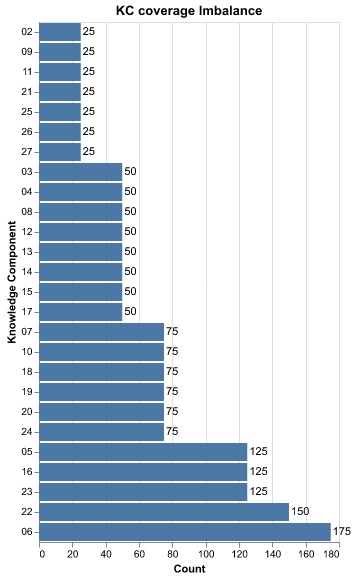
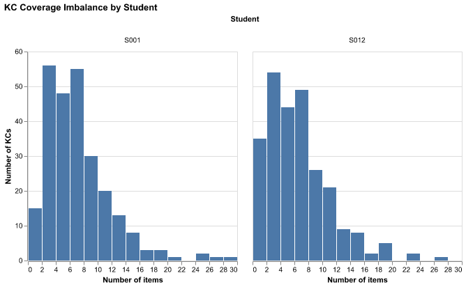
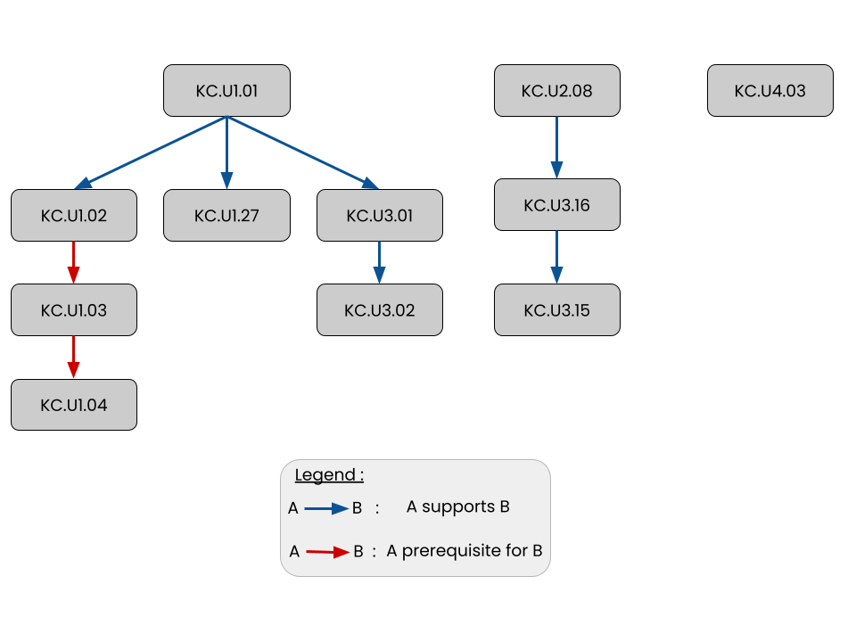
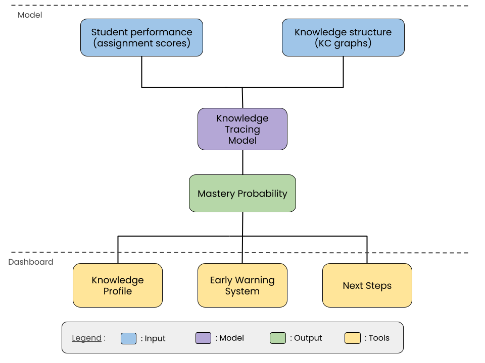

```{python}
import pandas as pd
from IPython.display import Markdown

missing_assignment = pd.read_csv('tables/missing_assignment.csv')
missing_student_assignment = pd.read_csv('tables/missing_student_assignment.csv')
student_summary = pd.read_csv('tables/student_summary.csv', index_col='observation')
kc_summary = pd.read_csv('tables/kc_summary.csv', index_col='observation')
kc_coverage_comparison_table = pd.read_csv('tables/kc_coverage_comparison_table.csv')
perf_summary = pd.read_csv('tables/perf_summary.csv', index_col='performance_band')
```

# Executive Summary

Currently, tutors are relying primarily on manual processes and human memory to track student progress. This often leads to a lack of reliable and timely signals as to which areas students are struggling with. Similarly, parents often get inconsistent and unclear pictures of how their children are progressing.


Our solution would be to provide tutors with a fully functional pipeline and dashboard that would provide them with all the necessary tools to track student progress with specific skills and ensure that they can get timely signals to detect potentially problematic areas for students.


# Introduction

The problem that we are tackling in this project is to help teachers track student mastery progress through time. This would allow us to ensure parents and students get timely feedback in a clear and concise manner.
Knowledge tracing is a machine learning method to track and predict a student’s mastery over time based on their performance data.


We have 3 main objectives for this project :


- Create a mastery tracker that uses knowledge tracing to estimate student's mastery probability
- Create an early warning system that flags areas that students are struggling with
- Create a dashboard application visualises the elements above and other students insights (e.g average scores)


The outcome of the project would be a fully functional and reproducible pipeline that updates the dashboard when given new data.


# Data & Exploratory Data Analysis (EDA)

```{python}

nb_students = student_summary.loc['nb_students','value']
nb_assignments = student_summary.loc['nb_assignments','value']
nb_observations = student_summary.loc['nb_observations','value']
nb_items = student_summary.loc['nb_items','value']

nb_kc = kc_summary.loc['nb_kc','value']
median_items_per_kc = kc_summary.loc['median_items_per_kc','value']
max_obs_per_kc = kc_summary.loc['max_obs_per_kc','value']
min_obs_per_kc = kc_summary.loc['min_obs_per_kc','value']
nb_zero_coverage = kc_summary.loc['nb_zero_coverage','value']

zero_coverage_full = kc_coverage_comparison_table[(kc_coverage_comparison_table['student_id']=='S001') & (kc_coverage_comparison_table['num_items']==0)]['kc_id'].nunique()
zero_coverage_missing = kc_coverage_comparison_table[(kc_coverage_comparison_table['student_id']=='S012') & (kc_coverage_comparison_table['num_items']==0)]['kc_id'].nunique()

nb_proficient = perf_summary.loc['Proficient','nb_students']
nb_emerging = perf_summary.loc['Emerging','nb_students']
```

The dataset comes from an AP Statistics course, with data collected over 7 months. It contains information about the course structure (how assignments are structured), the knowledge structure (how KC relationships are structured) and the student's performance (student scores) for `{python} int(nb_students)` students. The dataset spans across `{python} int(nb_assignments)` assignments (includes homeworks and exams for a total of `{python} int(nb_observations)` items) and  `{python} int(nb_kc)` knowledge components, for a total of `{python} format(int(nb_items), ",")` item-level student records.


The observational unit is the student item interaction, which represents a single student's response to a specific assignment question. The key variables are the student's scores, the knowledge component IDs (indicate which KCs each item assesses) and the KC graphs (provide information about how the KCs are related to each other).


## Key insights


### Missing values

Some students did not hand in assignments which has led to missing values in the data.

```{python}
#| label: tbl-missing_student_assignment
#| tbl-cap: "Number of students that are missing assignments."
Markdown(missing_student_assignment.to_markdown(index=False))
```

Looking at @tbl-missing_student_assignment, there are more students that are missing at least one assignment (`{python} int(missing_student_assignment[missing_student_assignment['Number of missing assignments']!=0]['Number of students'].sum())` students) than students not missing any (`{python} int(missing_student_assignment[missing_student_assignment['Number of missing assignments']==0]['Number of students'].sum())` students). However, most of the students with missing assignments are only missing one (`{python} int(round(100*missing_student_assignment[missing_student_assignment['Number of missing assignments']==1]['Number of students'].sum()/missing_student_assignment[missing_student_assignment['Number of missing assignments']>0]['Number of students'].sum(),0))`% of students with missing data), which implies that the missingness is relatively evenly spread out across students. 

```{python}
#| label: tbl-missing_assignment
#| tbl-cap: "Number of assignments that are missing students."
Markdown(missing_assignment.to_markdown(index=False))
```

Looking at @tbl-missing_assignment, the number of assignments that are missing students (`{python} str(int(round(missing_assignment[missing_assignment['Number of missing students']!=0]['Number of assignments'].sum()*100/nb_assignments,0)))`% of assignments) is close to the number of assignments that aren't missing students (`{python} str(int(round(missing_assignment[missing_assignment['Number of missing students']==0]['Number of assignments'].sum()*100/nb_assignments,0)))`% of assignments). This means that the missing data is relatively evenly spread across assignments, with no assignment missing more than 
`{python} str(int(missing_assignment['Number of missing students'].max()))` out of `{python} str(int(nb_students))` students (`{python} str(int(missing_assignment['Number of missing students'].max()*100/nb_students))`%). It also suggests that the missingness isn't due to an assignment specific issue.

The missing data seems to be sparse and well-distributed across the observations, with no assignment missing more than `{python} str(int(missing_assignment['Number of missing students'].max()))` students and most students (`{python} str(int(round(100*missing_student_assignment[missing_student_assignment['Number of missing assignments']==1]['Number of students'].sum()/missing_student_assignment[missing_student_assignment['Number of missing assignments']>0]['Number of students'].sum(),0)))`% of students with missing data) missing only 1 assignment. Overall, this suggests that missingess is unlikely to introduce significant bias into the analysis.


### KC coverage imbalance

{#fig-kc-coverage width=40%}

Looking at @fig-kc-coverage, the KC coverage is heavily right-skewed, with a median of `{python} str(int(median_items_per_kc))` items per KC. This imbalance means that some knowledge components contain up to `{python} str(int(max_obs_per_kc))` observations, while others are not assessed at all (`{python} str(int(nb_zero_coverage))` KCs with `{python} str(int(min_obs_per_kc))` observations). The difference in coverage among KCs could affect the reliability of mastery estimates for under-covered KCs.


{#fig-kc-coverage-comparison width=90%}

Looking at @fig-kc-coverage-comparison, both students have a similarly right-skewed KC coverage distribution, though S012's is shifted slightly more towards the left compared to S001, which is consistent with the 5 missing assignments. In fact, S012 has `{python} zero_coverage_missing` untested KCs compared to S001 who only has `{python} zero_coverage_full`, meaning that already under covered KCs are even sparser for S012. Overall, this means that having missing assignments may reduce the reliability of mastery estimates.

### Performance band imbalance
{#fig-performance-band width=50%}


Looking at @fig-performance-band, there is an imbalance in the performance band distribution, with there being `{python} int(nb_proficient/nb_emerging)` times as many proficient students (`{python} int(nb_proficient)`) as emerging (`{python} int(nb_emerging)`). This might lead to some prediction issues in the model building phase, since classifiers tend to provide less accurate estimates for underrepresented groups. This can be especially problematic since emerging students are precisely those that the early warning should reliably flag.


### Knowledge component relationships
{#fig-kc-graph width=70%}


Some knowledge components have prerequisite or support relationships, which means that students need to master the foundational KCs before progressing to the dependent ones. As shown in @fig-kc-graph, these dependencies can span multiple levels (e.g KC.U1.02 is a prerequisite for KC.U1.03 which itself is a prerequisite for KC.U1.04). This hierarchical structure needs to be taken into account in the modelling phase, since a student's performance might depend on how well they've mastered the prerequisites.


# Data Science Approach

Our approach uses knowledge tracing methods to estimate the probability that a student has mastered a knowledge component, based on their assignment scores and the KC relationship structure. These mastery estimates will be used in a dashboard which will contain insights into student performance along with 3 main components : a knowledge profile that summarises each student's strenghts and gaps, an early warning system that flags students that are struggling, and personalised suggested next steps.

{#fig-full-pipeline width=70%}

## Mastery Tracker
Our approach to estimating student mastery of the KC is going to be to use knowledge tracing models to build knowledge profiles for each student. Each profile will contain the KCs and the corresponding probability that the student has mastered it (mastery probability). These profiles will be dynamic and will be updated every time students interact with the KCs (i.e. every time a teacher inputs new data).

The mastery probabilities will be estimated using a knowledge tracing model. To determine which model we will be using, we will be building and comparing multiple different types of models to determine which one is the best fit for our data. The baseline model, to which we will compare the performance of all future models, will be a Bayesian Knowledge Tracing model. The simplicity and interpretability of this model makes it a natural choice as a baseline.


## Early Warning System
The early warning system will flag knowledge components whose estimated mastery probability has dropped below a certain threshold.


## Dashboard application
The dashboard application will display the Mastery Tracker as well as other insight into the students performance (average grades).


# Evaluation & Success Criteria


## Evaluation
We will be evaluating our approach on three fronts, as follows :


### Model Validity

To preserve the dependency structure between KCs, the data will be split into train and test sets by student. We will be evaluating the model performance by comparing the mastery probability to the final exam scores of the students. Using RMSE to determine how far the predicted mastery probabilities are from the actual test scores (smaller the RMSE the stronger the predictive validity of the model).


### Model Comparison

To find the model that is the best fit for our data, we will be comparing any model we fit to the baseline BKT model. Using RMSE and AIC/BIC we will be comparing the model fit with model complexity to ensure the final model fits all requirements.


### Early Warning System Validity

We will create a dataset using the student's performance band from Overall_Scores where Emerging students are labelled as Flag and the others are labelled as Not Flag. Using this dataset, we will be evaluating the Early Warning System as a binary classification problem with metrics like AUC, Precision and Recall to ensure that only necessary warnings are sent.


## Success Criteria
We will consider our project a success if all the following conditions are met :

- The mastery tracker reliably estimates student mastery
- The early warning system reliably signals student struggle
- The dashboard provides a clear and reliable way to show student progress
- The dashboard provides teachers with class-wide descriptive statistics inclusive of skills, knowledge components and overall status of a class
- The dashboard provides students with personal progress, areas of concerns alongside "what to practice next"​


# Timeline

The project will be split into weekly milestones. Each milestone contains a list of elements which must be completed by the given deadline.

| Milestone | Due Date | Description |
|:----------|:---------|:------------|
| Milestone 1 | May 8 | - Pipeline that outputs model ready dataset <br> - Bayesian Knowledge tracing model (model build and analysis) |
| Milestone 2 | May 15 | - Alternative models (model build and analysis) <br> - Dashboard skeleton design |
| Milestone 3 | May 22 | - Final dashboard design <br> - Final model selection |
| Milestone 4 | May 29 | - Dashboard update pipeline <br> - Early warning system |
| Milestone 5 | June 25 | - Production ready product |


